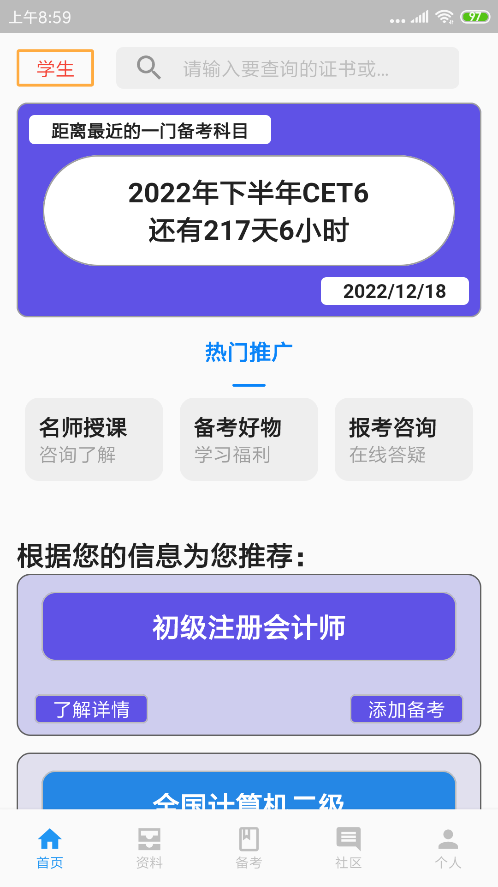
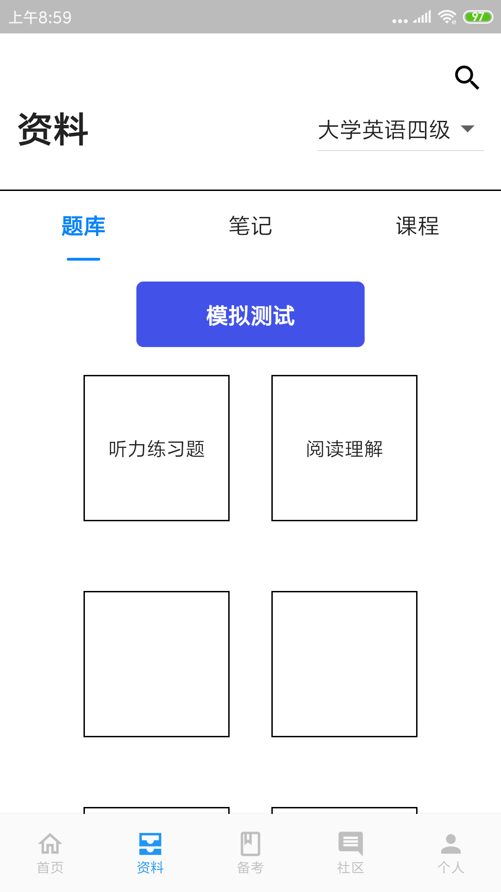
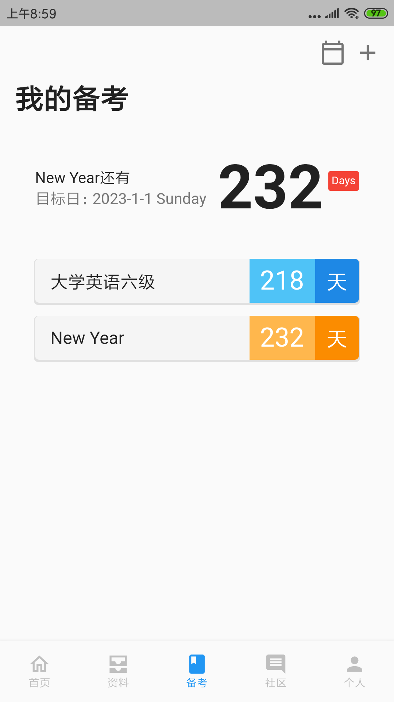
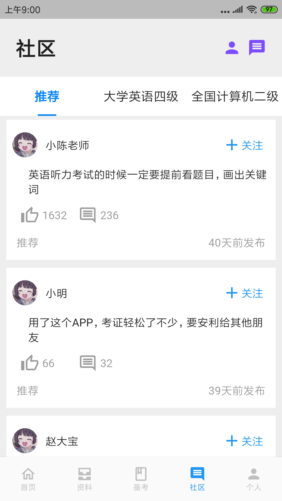
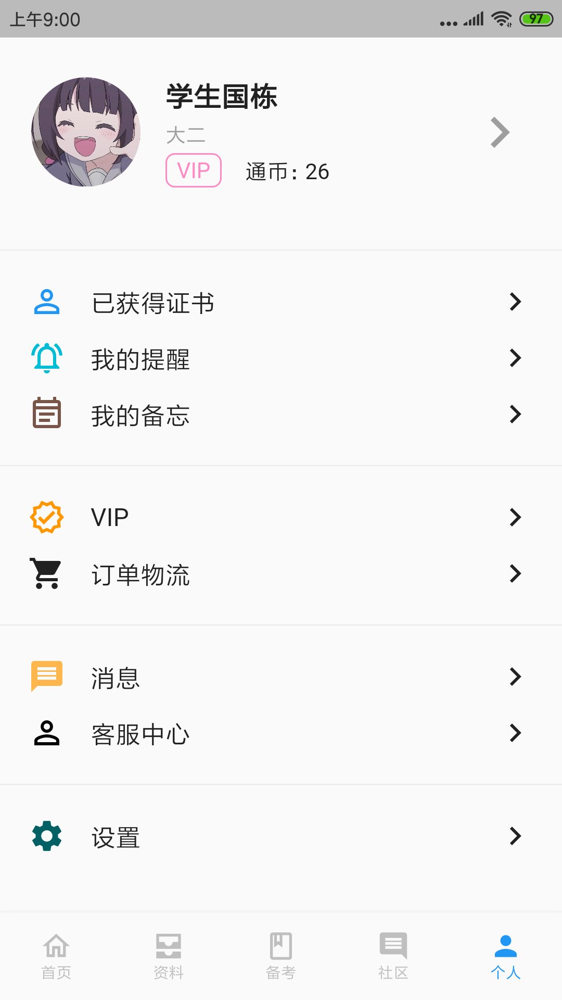
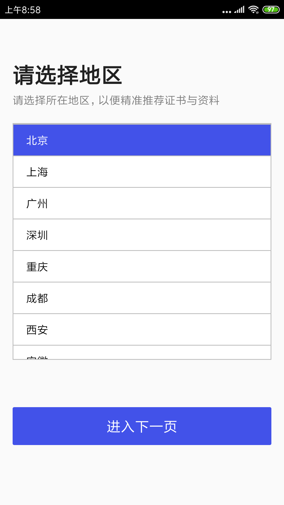
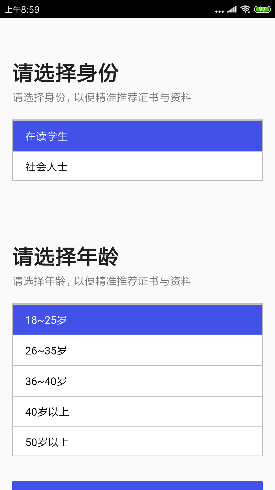
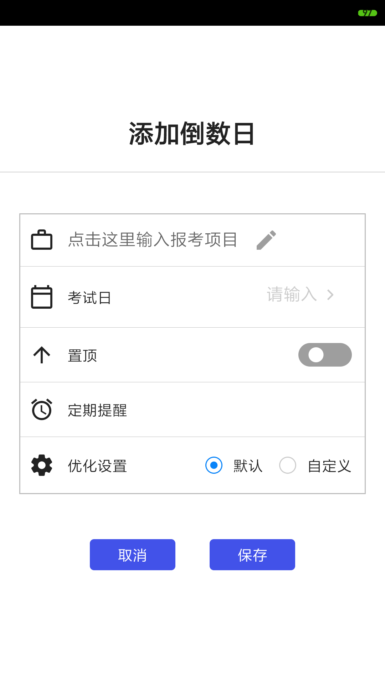
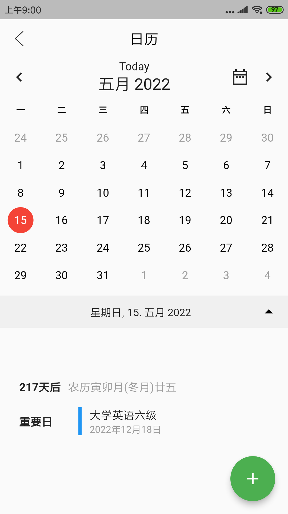
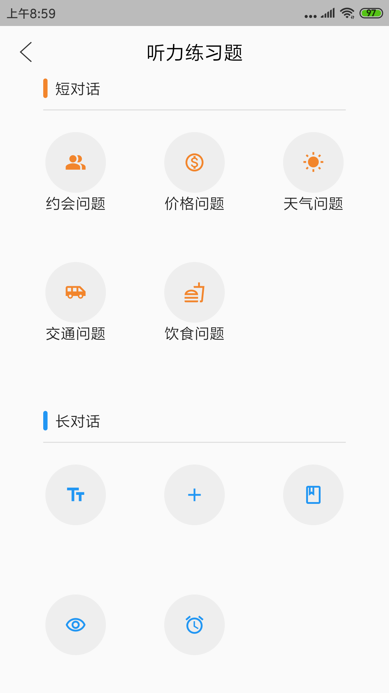

  
  <h3><code>证证通</code></h3>
  
<em>证证通，你的考证助手</em>

  
  

## 如何下载安装？

> 考证助手app，目前只实现UI页面，后续再考虑接入api

## 📷 Screenshot （只展示主要页面）
### 主页面

  <figure class="third">
      
  </figure>

### 启动页

  <figure class="third">
      
  </figure>

### 备考页

  <figure class="third">
      
  </figure>

### 资料页

  <figure class="third">
      
  </figure>

### 社区页

  <figure class="third">
      
  </figure>

### 个人页

  <figure class="third">
      
  </figure>

## ⚖️ License

[MIT](LICENSE)

